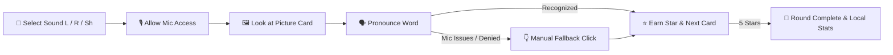

<div align="center">

# 🗣️ Til Up — 🚀 Тіл Ап

### **Bilingual Speech Practice Game for Children | Детская игра для тренировки речи**

[](https://github.com/serik-k/til-up/actions/workflows/ci.yml)
[](https://vuejs.org/)
[](https://www.typescriptlang.org/)
[](https://vitejs.dev/)
[](https://tailwindcss.com/)
[](https://developer.mozilla.org/en-US/docs/Web/API/Web_Speech_API)
[](#-privacy--microphone-use--приватность)

<p align="center">
  <b>Interactive, friendly, and privacy-first speech exercises in Russian & Kazakh</b><br>
  <b>Интерактивная и безопасная тренировка правильного произношения звуков «Л», «Р», «Ш»</b>
</p>

---

[ English ](#-english-overview) • [ Русский ](#-русский-обзор) • [ Quick Start ](#-quick-start--быстрый-запуск) • [ Architecture ](#-project-structure--структура-проекта)

---

</div>

<br>

## 📌 English Overview

**Til Up** is a browser-based speech practice app designed for kids. It guides children through engaging, bite-sized pronunciation exercises targeting tricky sounds (**Л**, **Р**, and **Ш**) using bright visual cards, audio hints, interactive mascot reactions, and a motivational star-reward system.

The core gameplay is **voice-first**: the child selects a target sound, looks at a picture card, and pronounces the word out loud. The game leverages the native browser **Web Speech API** to recognize spoken words in real time. If speech recognition is unsupported or microphone permissions are unavailable, an instant **manual fallback button** seamlessly takes over so the fun never stops.

---

### ✨ Key Features

| Feature | Description |
| :--- | :--- |
| 🌐 **Bilingual Support** | Complete Kazakh (KZ) and Russian (RU) interfaces & curated word decks. |
| 🎴 **18 Sound Decks** | 18 localized practice cards focused on challenging **Л**, **Р**, and **Ш** sounds. |
| 🎙️ **Voice-First Engine** | Real-time speech recognition via browser native Web Speech API with TTS examples. |
| 🛡️ **Zero-Backend Privacy** | 100% client-side app. No audio recordings uploaded, no trackers, no servers. |
| 🔄 **Smart Fallback** | Automatic manual click fallback if microphone access fails or is denied. |
| 📊 **Parent Progress** | Session history and word counts stored strictly in local `localStorage`. |
| ♿ **Accessible Design** | Responsive, full keyboard navigation, and reduced-motion visual support. |
| 🚀 **SEO & OpenGraph** | Meta tags, canonical URLs, `hreflang`, structured JSON-LD, and social previews. |

---

### 🕹️ How It Works



> [!NOTE]
> **Pedagogical & Clinical Note:**
> **Til Up** verifies recognized words for repetition practice; it **does not** analyze phonetic articulation quality or perform medical diagnostics. It is meant for enjoyable home practice and is not a substitute for professional speech-language therapy.

---

### 🛡️ Privacy & Microphone Use

- **No Remote Servers**: Audio data is **never** sent to any custom backend server.
- **Local Storage Only**: Practice history and star counts stay strictly inside `localStorage`.
- **Browser Standard API**: Speech recognition runs through the browser's implementation of `SpeechRecognition`.
- **On-Demand Access**: Microphone access is requested only when an exercise active session begins.

---

<br>

---

<br>

## 🇷🇺 Русский обзор

**Til Up** — это яркая и добрая браузерная игра для развития речи у детей. Она помогает ребёнку отрабатывать правильное произношение наиболее частых «трудных» звуков (**Л**, **Р** и **Ш**) через короткие игровые упражнения с красочными карточками, озвучкой, реакциями живого маскота и звёздными наградами.

Игра построена на **голосовом взаимодействии**: ребёнок выбирает звук, видит карточку со словом и произносит его вслух. Приложение использует встроенный в браузер **Web Speech API** для распознавания речи в реальном времени. Если микрофон недоступен или браузер не поддерживает распознавание, автоматически включается **ручной режим (fallback)**, благодаря которому ребёнок может продолжить игру без препятствий.

---

### ⚡ Главные возможности

- 🇰🇿 🇷🇺 **Два языка**: Полноценный интерфейс и наборы слов на казахском и русском языках.
- 🎴 **18 красочных карточек**: Локализованный набор для закрепления звуков «Л», «Р» и «Ш».
- 🗣️ **Распознавание речи**: Озвучивание примеров и проверка произнесённого слова средствами браузера.
- 🛡️ **100% Конфиденциальность**: Без бэкенда, без записи звука, без передачи личных данных.
- 🔄 **Умная страховка (Fallback)**: Игра не блокируется при отсутствии микрофона — включается кнопка подтверждения.
- 📈 **Статистика для родителей**: Учёт занятий и повторённых слов сохраняется только в браузере.
- ♿ **Доступность и комфорт**: Поддержка управления с клавиатуры, адаптивность и режим `reduced-motion`.
- 🔍 **SEO & Метаданные**: Полная подготовка `OpenGraph`, `JSON-LD`, `hreflang` и канонических ссылок.

---

### 🛠️ Игровой процесс

1. **Выбор звука**: Выберите один из тренируемых звуков (**Л**, **Р** или **Ш**).
2. **Разрешение микрофона**: Нажмите «Начать» и разрешите доступ к микрофону.
3. **Произношение**: Назовите предмет, изображённый на карточке.
4. **Сбор звёзд**: Соберите 5 звёзд, чтобы успешно завершить сессию.
5. **Прогресс**: Просматривайте динамику упражнений в локальной панели статистики.

> [!IMPORTANT]
> **Информация для родителей:**
> Til Up распознаёт совпадение названий картинок для поддержания интереса к тренировке, но **не является диагностическим или логопедическим медицинским прибором**. Приложение создано для домашней практики и не заменяет индивидуальные занятия с логопедом.

---

<br>

## 💻 Tech Stack | Технологический стек

| Technology | Purpose / Описание |
| :--- | :--- |
|  | Progressive framework using Composition API & Script Setup |
|  | Strictly typed state management and speech engine interfaces |
|  | Next-generation frontend build tooling & HMR dev server |
|  | Utility-first CSS frame with responsive & dark/light styling |
|  | Reactive browser utilities collection |
|  | Universal document head & SEO metadata manager |
|  | Native SpeechRecognition & SpeechSynthesis browser engine |

---

## 🚀 Quick Start | Быстрый запуск

### Requirements / Требования
- **Node.js**: `v18.x` or higher (LTS recommended)
- **npm**: `v9.x` or higher

```bash
git clone https://github.com/serik-k/til-up.git
cd til-up
npm install
npm run dev
```

> Open your browser at `http://localhost:5173` (or the Vite dev URL displayed in terminal).

---

## 🧪 Quality Checks & Build | Проверка качества и сборка

```bash
# Type check
npm run type-check

# Type check + production build (same command used by CI)
npm run check

# Production build
npm run build

# Local preview
npm run preview
```

Every pull request targeting `main` runs the same type-check + production build pipeline in GitHub Actions.

---

## 🏗️ Project Structure | Структура проекта

```text
til-up/
├── 📁 public/
│   ├── 📁 images/speech-cards/   # 🖼️ Sound card artwork & assets
│   └── 📄 robots.txt             # 🤖 Search engine crawlers config
├── 📁 src/
│   ├── 📁 app/                   # 🚀 Application shell & main view setup
│   ├── 📁 assets/                # 🎨 Static styles & global graphics
│   ├── 📁 components/            # 🧩 Game UI and mascot components
│   ├── 📁 composables/           # 🎙️ Speech recognition & synthesis lifecycle hooks
│   ├── 📁 locales/               # 🌍 Multilingual strings (RU / KZ)
│   ├── 📁 styles/                # 💅 Tailwind & custom CSS utility styles
│   ├── 📁 types/                 # 📐 TypeScript definitions & interfaces
│   └── 📄 content.ts             # 🎴 Russian & Kazakh speech card decks data
├── 📄 index.html                 # 📄 Entry point HTML with SEO metadata
├── 📄 vite.config.js             # ⚡ Vite build configuration
├── 📄 tailwind.config.js         # 🎨 Tailwind CSS design system theme
└── 📄 package.json               # 📦 Dependencies & npm scripts
```

---

## 🤝 Contributing | Участие в разработке

Contributions are welcome! If you'd like to improve **Til Up**:

1. Fork the project repository.
2. Create your feature branch (`git checkout -b feature/AmazingFeature`).
3. Run `npm run check` to verify type safety and the production build.
4. Commit your changes (`git commit -m 'Add some AmazingFeature'`).
5. Push the branch (`git push origin feature/AmazingFeature`).
6. Open a Pull Request.

> [!TIP]
> *Note on new content*: Any new speech cards or therapeutic word additions should be verified by native speakers and, ideally, reviewed by a certified speech-language pathologist.

---

## 📄 License | Лицензия

Private repository / All rights reserved. License decision pending.

Все права защищены. Публичный доступ к коду не означает свободу повторного использования без разрешения правообладателя.

---

<div align="center">
  <sub>Made with ❤️ for kids and parents | Сделано с любовью для детей и родителей</sub>
</div>
